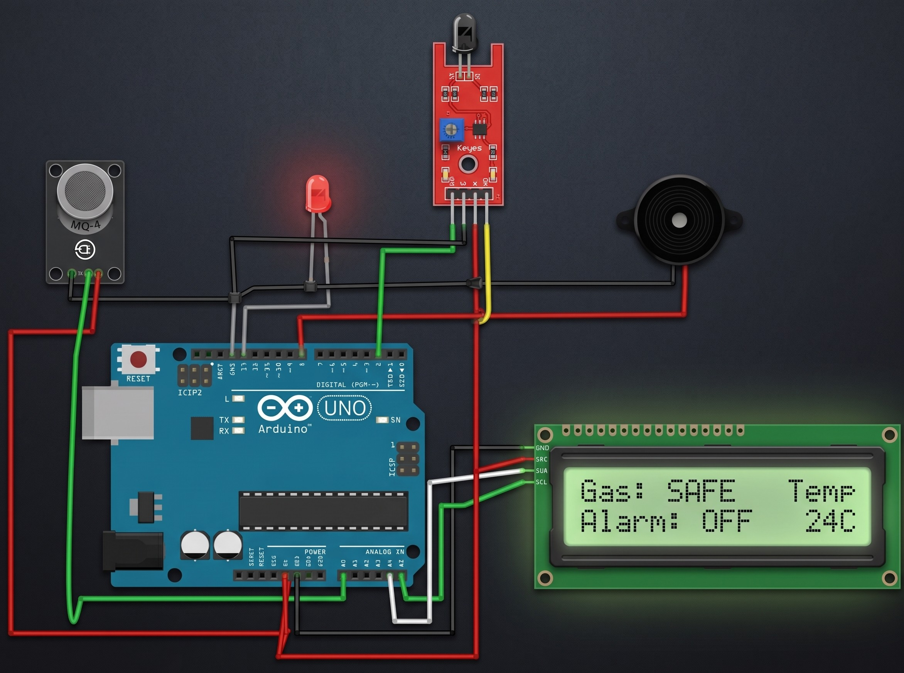
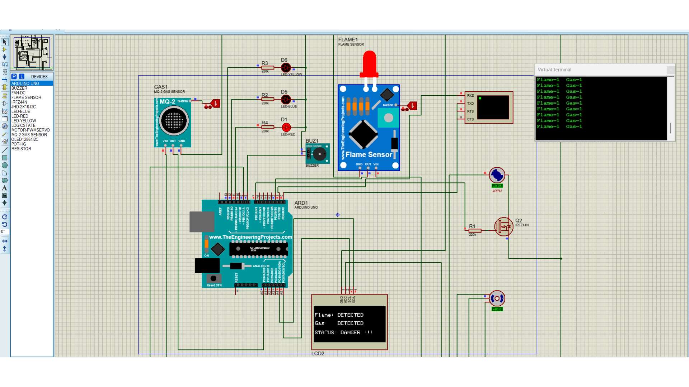
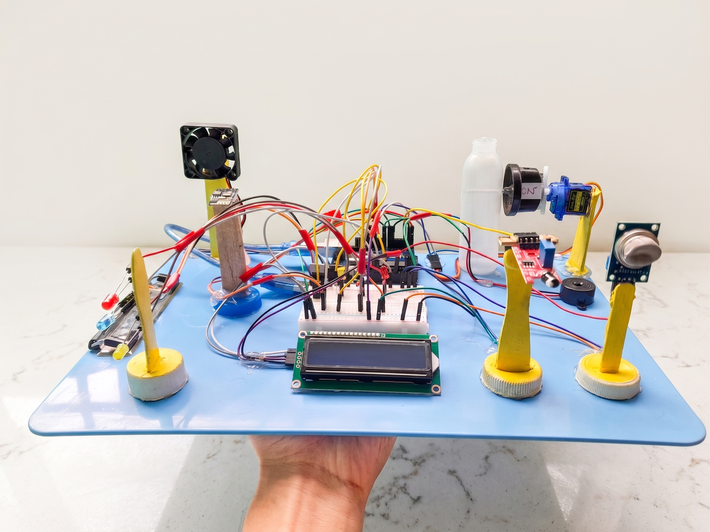
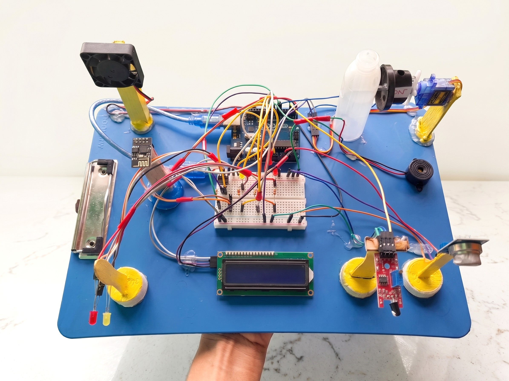

# Arduino-Based Gas Leakage and Fire Detection System

An Arduino-based safety and prevention system designed to detect **gas leakage** and **fire**, provide visual and audible alerts, display system status on an LCD, and activate safety mechanisms such as a fan and servo motor. The project also includes **RemoteXY-based Wi-Fi monitoring** and a **Proteus simulation**.

## Features

- Gas leakage detection using a gas sensor.
- Fire/flame detection using a flame sensor.
- Multi-level gas status indication using Yellow, Blue, and Red LEDs.
- Buzzer alert with different blinking intervals for warning levels.
- 16×2 I2C LCD status display.
- Automatic fan activation during warning, high, danger, or fire conditions.
- Servo motor activation as part of the safety mechanism.
- RemoteXY-based Wi-Fi monitoring.
- Proteus simulation files and sensor libraries.
- Complete project report, proposal, and presentation included.

## Project Structure

```text
Farm-Gas-Fire-Safety-System/
├── Code/
│   ├── Project_Code.ino
│   ├── Project_final.ino
│   ├── Project_final.ino.standard.hex
│   └── Project_final.ino.with_bootloader.standard.hex
├── Project_Documents/
│   ├── Project Report.docx
│   ├── Project_Proposal.docx
│   └── Project-Presentationt.pptx
├── Proteus_Simulation/
│   ├── Project simulation.pdsprj
│   ├── Project simulation.pdsprj.RISHAD.najiy.workspace
│   ├── Flame Sensor Library for Proteus/
│   ├── Gas Sensor Library for Proteus/
│   ├── Proteus Simulation/
│   └── Project_Backups/
├── Screenshots/
│   ├── 01_Connection_Diagram.jpg
│   ├── 02_Proteus_Simulation.png
│   ├── 03_Hardware_Project_Setup_1.png
│   └── 04_Hardware_Project_Setup_2.png
├── Notes/
│   └── fan & Wifi Connection.txt
├── .gitattributes
└── README.md
```

## Hardware & Software

- Arduino Uno
- Gas Sensor
- Flame Sensor
- 16×2 I2C LCD
- Servo Motor
- DC Fan
- Buzzer
- Yellow, Blue & Red LEDs
- ESP8266 Wi-Fi Module
- MOSFET-based fan driver
- Proteus Design Suite
- Arduino IDE
- RemoteXY

## Setup Instructions

1. Open the main Arduino code from the `Code` folder.
2. Open the project in Arduino IDE.
3. Install the required Arduino libraries used by the code.
4. Connect the hardware according to the connection diagram in the `Screenshots` folder.
5. Configure the ESP8266/RemoteXY setup as used in the project.
6. Upload the code to the Arduino.
7. For simulation, open the Proteus project from the `Proteus_Simulation` folder.
8. Use the project report and proposal in `Project_Documents` for detailed project information.

> **Note:** The existing project code and project files have been kept unchanged. Only the repository organization, image filenames, and README presentation have been improved.

## Project Video

Watch the project demonstration video:

https://drive.google.com/file/d/1wD68LAWmDfM2FbtxOK6bFTiDMuHZdvbH/view?usp=sharing

## Project Screenshots

### 1. Connection Diagram


### 2. Proteus Simulation


### 3. Hardware Project Setup


### 4. Hardware Project Setup


## How to Use

1. Upload the required Arduino code from the `Code` folder.
2. Connect the sensors, LCD, LEDs, buzzer, fan, servo, and Wi-Fi module according to the provided connection diagram.
3. Power on the system.
4. Monitor gas values and system status through the LCD and RemoteXY interface.
5. Test the gas and flame detection functions.
6. For complete implementation details, refer to the project report and presentation.

 Clone the repository to your local machine:

   ```bash
   git clone https://github.com/munshi-rishad/Arduino-Based-Gas-Leakage-and-Fire-Detection-System-With-Prevention-and-Safety-Mechanisms.git
